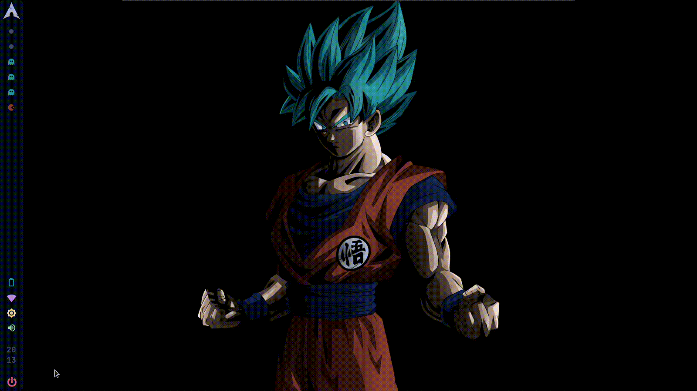
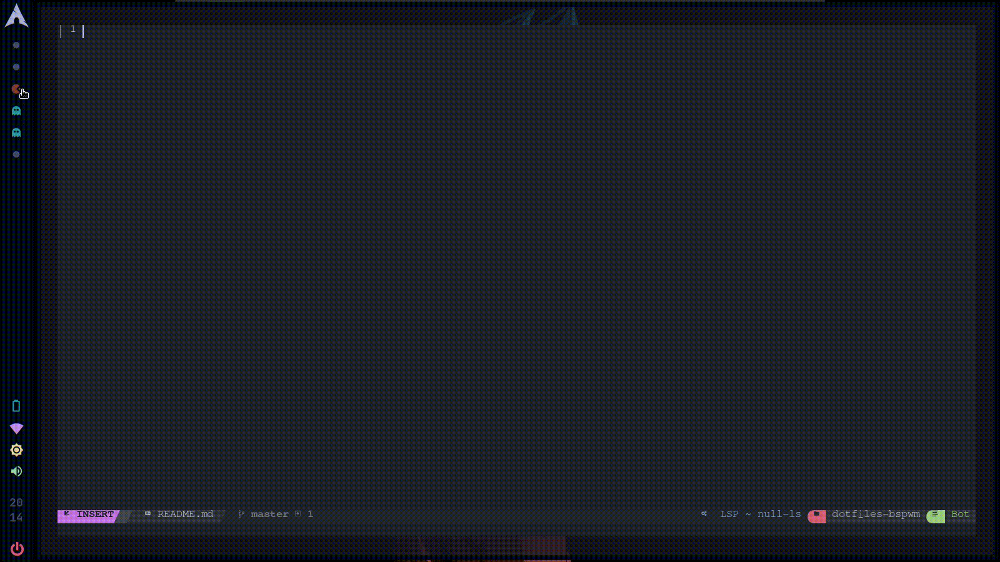
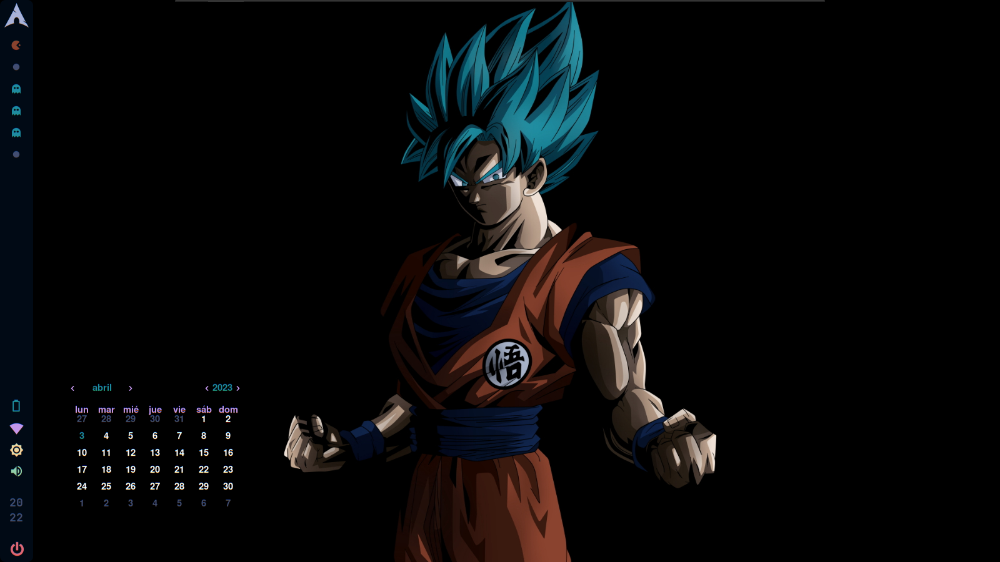
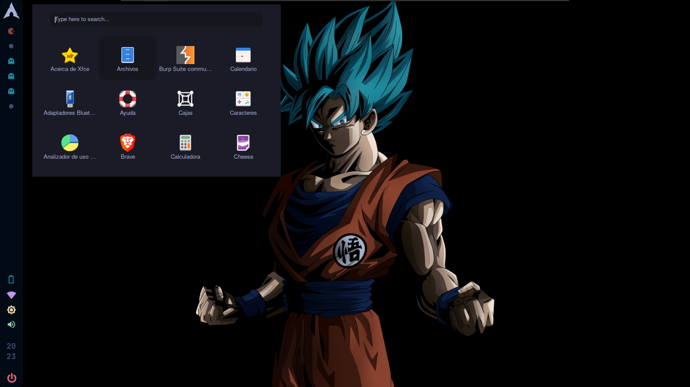
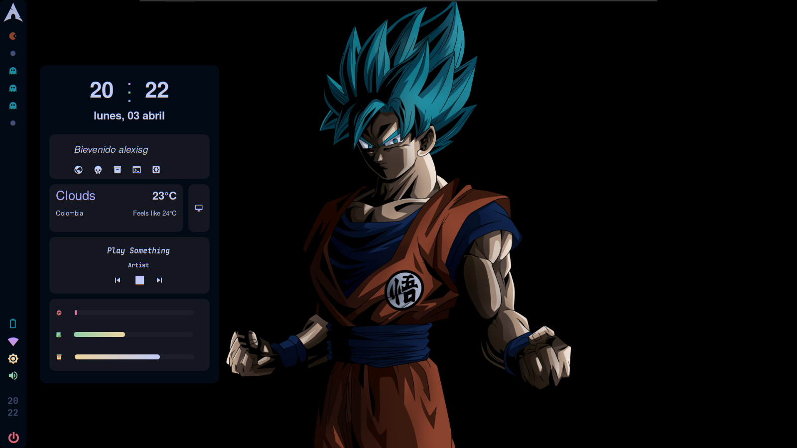

<p align="center"><a href="https://github.com/hacklexander/LICENSE"></a></p>


# My configuration BSPWM in Arch 


|    Distro    |                                               [Arch](https://archlinux.org/)                                                |
| :----------: | :-------------------------------------------------------------------------------------------------------------------------: |
|      WM      |                                        [BSPWM](https://github.com/baskerville/bspwm)                                        |
|     Bar      |                                        [Polybar](https://github.com/polybar/polybar)                                        |
|     Menu     |                                         [Rofi](https://github.com/davatorium/rofi)                                          |
|  Compositor  |                               [Picom](https://archlinux.org/packages/community/x86_64/picom/)                               |
|   Terminal   |                               [Kitty](https://archlinux.org/packages/community/x86_64/kitty/)                               |
|   Widgets    |                                  [ElKowars wacky widgets ](https://github.com/elkowar/eww)                                  |
| Music/Player | [mpd](https://archlinux.org/packages/extra/x86_64/mpd/)-[ncmpcpp](https://archlinux.org/packages/community/x86_64/ncmpcpp/) |
| File Manager |                              [Nautilus](https://archlinux.org/packages/extra/x86_64/nautilus/)                              |
|    Shell     |                                   [Zsh](https://archlinux.org/packages/extra/x86_64/zsh/)                                   ||


---
---


|  |  |
| ----------------------------------------------------------------------------------- | ------------------------------------------------------------------------------------ |

<details>
<summary><b>More</b></summary>

|  |  |  |
| -------------------------------------------------------------------------------- | ------------------------------------------------------------------------ | ---------------------------------------------------------------------------------- |

</details>

---

<details><summary><b>📦 Instalacion dependencias</b></summary>

Lo primero que debemos hacer es instalar todas las dependencias que necesitaremos para que la configuracion funcione correctamente y sin errores.

```bash
sudo pacman -S pacman-contrib polybar brightnessctl dunst rofi   lsd \
			  jq polkit-gnome git playerctl mpd ncmpcpp geany ranger mpc picom \
			  feh ueberzug maim pamixer libwebp webp-pixbuf-loader xorg-xprop \ xorg-xkill physlock papirus-icon-theme \
			  ttf-jetbrains-mono ttf-jetbrains-mono-nerd ttf-terminus-nerd ttf-inconsolata ttf-joypixels nautilus --noconfirm

yay -S eww --noconfirm
```

Habilitamos servicios:

```bash
sudo systemctl enable mpd.service
sudo systemctl start mpd.service
```
</details>

---

<details><summary><b>Instalacion Dotfiles</b></summary>

Posteriormente a esto lo que tendremos que hacer un git clone para descargar el repositorio y tenerlo localmente, aconsejo clonarlo en la carpeta **`/tmp`**, los comandos son los siguientes:

```bash
cd /tmp
git clone https://github.com/hacklexander/dotfiles-bspwm.git
cd dotfiles-bspwm/
```

Una vez tengamos el repositorio de manera local, lo que tenemos que hacer es copear las carpetas del directorio **`config/`**, los comandos son lo siguientes:

```bash
cp -r config/* ~/.config
```

Ahora haremos lo mismo con el direcorio **`fonts/`**:

```bash
cp -r fonts/* ~/.fonts
```

Copiamos el **`.zshrc`** y **`launcher`**:

```bash
cp -r home/.zshrc $HOME && cp -r home/launcher ~/.local/bin
```

----
</details>

---

Estas configuraciones estan basadas mayormente en los dotfiles de ***[gh0stzk](https://github.com/gh0stzk/dotfiles)***, dejo los creditos correspondientes, tambien hay configuraciones personales, puede que a todos no les guste, pero no esta de mas que las puedan probar y darme su opinion constructiva.